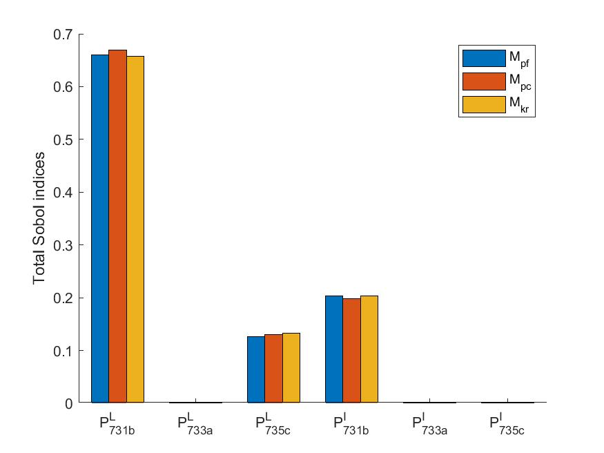

# GSA_DistributionSystem

`Under Development`

Code for the paper: [A Data-Driven Global Sensitivity Analysis Framework for Three-Phase Distribution System With PVs](https://ieeexplore.ieee.org/document/9387134)  

## Requriements

[OpenDSS](https://www.epri.com/pages/sa/opendss#:~:text=What%20is%20OpenDSS%3F,grid%20integration%20and%20grid%20modernization.)  

[UQLab](https://www.uqlab.com/)

## Case IEEE-37

  
[V_731a](https://github.com/ktye-UF/GSA_DistributionSystem/blob/main/plot/result-3.jpg)
&nbsp;&nbsp;&nbsp;&nbsp;&nbsp;&nbsp;&nbsp;&nbsp;&nbsp;&nbsp;&nbsp;&nbsp;&nbsp;&nbsp;&nbsp;&nbsp;&nbsp;&nbsp;&nbsp;&nbsp;
&nbsp;&nbsp;&nbsp;&nbsp;&nbsp;&nbsp;&nbsp;&nbsp;&nbsp;&nbsp;&nbsp;&nbsp;&nbsp;&nbsp;&nbsp;&nbsp;&nbsp;&nbsp;&nbsp;&nbsp;
  &nbsp;&nbsp;&nbsp;&nbsp;&nbsp;&nbsp;&nbsp;&nbsp;&nbsp;&nbsp;&nbsp;&nbsp;&nbsp;&nbsp;&nbsp;&nbsp;&nbsp;
[V_731b](https://github.com/ktye-UF/GSA_DistributionSystem/blob/main/plot/result-3.jpg)
&nbsp;&nbsp;&nbsp;&nbsp;&nbsp;&nbsp;&nbsp;&nbsp;&nbsp;&nbsp;&nbsp;&nbsp;&nbsp;&nbsp;&nbsp;&nbsp;&nbsp;&nbsp;&nbsp;&nbsp;
  &nbsp;&nbsp;&nbsp;&nbsp;&nbsp;&nbsp;&nbsp;&nbsp;&nbsp;&nbsp;&nbsp;&nbsp;&nbsp;&nbsp;&nbsp;&nbsp;&nbsp;&nbsp;&nbsp;&nbsp;
  &nbsp;&nbsp;&nbsp;&nbsp;&nbsp;&nbsp;&nbsp;&nbsp;&nbsp;&nbsp;&nbsp;&nbsp;&nbsp;&nbsp;&nbsp;&nbsp;&nbsp;
[V_731c](https://github.com/ktye-UF/GSA_DistributionSystem/blob/main/plot/result-3.jpg)

  

