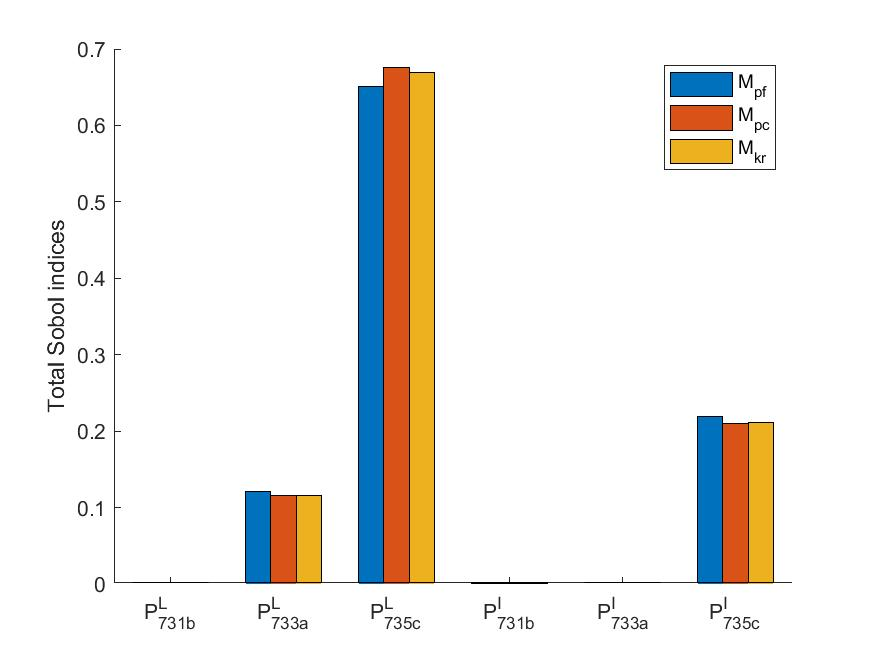

# GSA_DistributionSystem

`Under Development`

Code for the paper: [A Data-Driven Global Sensitivity Analysis Framework for Three-Phase Distribution System With PVs](https://ieeexplore.ieee.org/document/9387134)  

## Requriements

[OpenDSS](https://www.epri.com/pages/sa/opendss#:~:text=What%20is%20OpenDSS%3F,grid%20integration%20and%20grid%20modernization.)  

[UQLab](https://www.uqlab.com/)

## Case IEEE-37
System: IEEE-37 bus with PVs  
X: loads at nodes 731b,733c,735c & PVs at nodes 731b, 733a, 735c  
Y: total Sobol index  
Model: Monte Carlo, polynomial chaos expansion, Gaussian process

### Demo

&nbsp;&nbsp;&nbsp;&nbsp;&nbsp;&nbsp;&nbsp;&nbsp;&nbsp;&nbsp;&nbsp;&nbsp;&nbsp;&nbsp;&nbsp;&nbsp;&nbsp;&nbsp;&nbsp;&nbsp;

